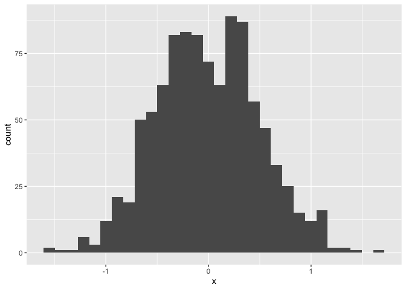

Simple document
================
2023-09-12

    ## Warning: replacing previous import 'lifecycle::last_warnings' by
    ## 'rlang::last_warnings' when loading 'tibble'

    ## Warning: replacing previous import 'ellipsis::check_dots_unnamed' by
    ## 'rlang::check_dots_unnamed' when loading 'tibble'

    ## Warning: replacing previous import 'ellipsis::check_dots_used' by
    ## 'rlang::check_dots_used' when loading 'tibble'

    ## Warning: replacing previous import 'ellipsis::check_dots_empty' by
    ## 'rlang::check_dots_empty' when loading 'tibble'

    ## Warning: replacing previous import 'lifecycle::last_warnings' by
    ## 'rlang::last_warnings' when loading 'pillar'

    ## Warning: replacing previous import 'ellipsis::check_dots_unnamed' by
    ## 'rlang::check_dots_unnamed' when loading 'pillar'

    ## Warning: replacing previous import 'ellipsis::check_dots_used' by
    ## 'rlang::check_dots_used' when loading 'pillar'

    ## Warning: replacing previous import 'ellipsis::check_dots_empty' by
    ## 'rlang::check_dots_empty' when loading 'pillar'

    ## Warning: replacing previous import 'lifecycle::last_warnings' by
    ## 'rlang::last_warnings' when loading 'hms'

    ## Warning: replacing previous import 'ellipsis::check_dots_unnamed' by
    ## 'rlang::check_dots_unnamed' when loading 'hms'

    ## Warning: replacing previous import 'ellipsis::check_dots_used' by
    ## 'rlang::check_dots_used' when loading 'hms'

    ## Warning: replacing previous import 'ellipsis::check_dots_empty' by
    ## 'rlang::check_dots_empty' when loading 'hms'

    ## ── Attaching packages ─────────────────────────────────────── tidyverse 1.3.0 ──

    ## ✓ ggplot2 3.3.3     ✓ purrr   0.3.4
    ## ✓ tibble  3.1.0     ✓ dplyr   1.0.5
    ## ✓ tidyr   1.1.3     ✓ stringr 1.4.0
    ## ✓ readr   1.4.0     ✓ forcats 0.5.1

    ## ── Conflicts ────────────────────────────────────────── tidyverse_conflicts() ──
    ## x dplyr::filter() masks stats::filter()
    ## x dplyr::lag()    masks stats::lag()

    ## 
    ## Attaching package: 'rlang'

    ## The following objects are masked from 'package:purrr':
    ## 
    ##     %@%, as_function, flatten, flatten_chr, flatten_dbl, flatten_int,
    ##     flatten_lgl, flatten_raw, invoke, splice

I’m an R Markdown document!

# Section 1

Here’s a **code chunk** that samples from a *normal distribution*:

``` r
samp = rnorm(100)
length(samp)
```

    ## [1] 100

# Section 2

I can take the mean of the sample, too! The mean is 0.0397963.

# Section 3: Make a plot

This code is borrowed from last lecture- this code creates a dataset for
a plot.

``` r
plot_df = 
  tibble(
    x = rnorm(1000, sd = .5),
    y = 1 + 2 * x + rnorm(1000)
  )
```

Next up is a histogram of the `x` variable in `plot_df`

``` r
ggplot(plot_df, aes(x = x)) + geom_histogram()
```

    ## `stat_bin()` using `bins = 30`. Pick better value with `binwidth`.

<!-- -->

# Section 4

Write a named code chunk that creates a dataframe comprised of: a
numeric variable containing a random sample of size 500 from a normal
variable with mean 1; a logical vector indicating whether each sampled
value is greater than zero; and a numeric vector containing the absolute
value of each element. Then, produce a histogram of the absolute value
variable just created. Add an inline summary giving the median value
rounded to two decimal places. What happens if you set eval = FALSE to
the code chunk? What about echo = FALSE?

``` r
#set <-
#data.frame(
#  r_norm = rnorm(500, mean = 1),
#  big_zero = r_norm > 0,
#  abs_val = abs(r_norm)
#)
```
